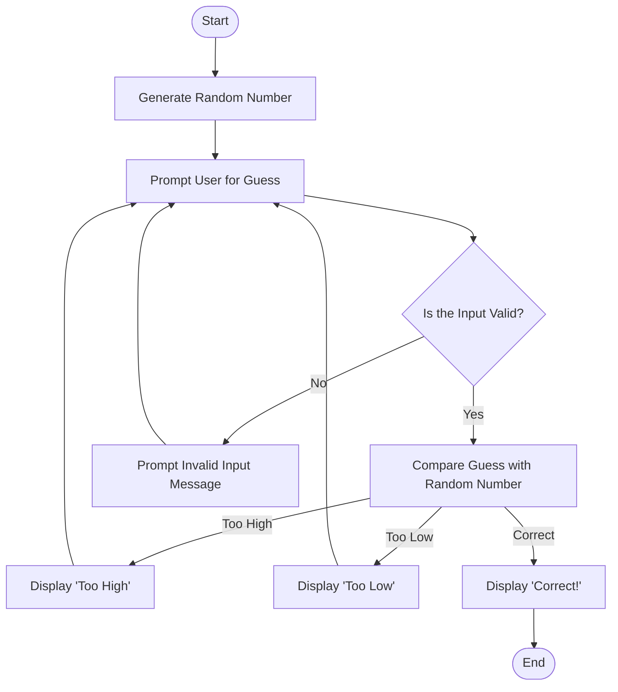

# Guessing Game Flowchart

This flowchart represents the sequence of events in a guessing game where the user tries to guess a randomly generated number within a specified range.

## Flowchart

1. Start: The game begins.
2. Generate Random Number: The computer selects a random number within a defined range.
3. Prompt User for Guess: The user is prompted to input a guess.
4. Validate Input: The input is checked to ensure it is a valid numeric value.
    - If invalid, prompt the user to enter a valid guess.
5. Compare Guess: The guess is compared to the random number.
    - If too high, display "Too High" and prompt for another guess.
    - If too low, display "Too Low" and prompt for another guess.
    - If correct, display "Correct" and end the game.
6. End: The game ends when the user guesses correctly.
